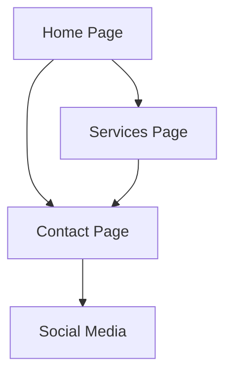

## 1. Product Overview
Portfolio web profesional para NEXABYTE - Soluciones Informáticas. Una plataforma moderna que presenta los servicios tecnológicos de la empresa con un diseño futurista que refleja innovación y expertise en el sector IT.

El portafolio permite a clientes potenciales conocer los servicios ofrecidos, la experiencia de la empresa y establecer contacto de manera directa, posicionando a NEXABYTE como un proveedor confiable de soluciones tecnológicas.

## 2. Core Features

### 2.1 User Roles
| Role | Registration Method | Core Permissions |
|------|---------------------|------------------|
| Visitor | No registration required | Browse all content, view services, contact form |

### 2.2 Feature Module
El portafolio de NEXABYTE consta de las siguientes páginas principales:
1. **Home page**: hero section con logo animado, presentación de la empresa, servicios destacados.
2. **Services page**: lista completa de servicios informáticos con descripciones detalladas.
3. **Contact page**: formulario de contacto, información de contacto y redes sociales.

### 2.3 Page Details
| Page Name | Module Name | Feature description |
|-----------|-------------|---------------------|
| Home page | Hero section | Mostrar logo NEXABYTE con efecto de brillo neón, animación de entrada del texto "SOLUCIONES INFORMÁTICAS", botón de llamada a la acción para servicios. |
| Home page | Company presentation | Descripción breve de NEXABYTE, valores de la empresa, experiencia en el sector. |
| Home page | Featured services | Mostrar 3-4 servicios principales con iconos animados, enlaces a página de servicios completos. |
| Services page | Services grid | Lista de todos los servicios ofrecidos: desarrollo web, aplicaciones móviles, consultoría IT, soporte técnico, etc. |
| Services page | Service details | Cada servicio con descripción completa, beneficios, tecnologías utilizadas, casos de éxito. |
| Contact page | Contact form | Formulario con campos: nombre, email, teléfono, tipo de proyecto, mensaje, validación de campos requeridos. |
| Contact page | Contact information | Dirección física, teléfono, email corporativo, horario de atención. |
| Contact page | Social media | Enlaces a LinkedIn, GitHub, y otras redes profesionales relevantes. |

## 3. Core Process
**Flujo del Visitante:**
1. Usuario accede al sitio web
2. Visualiza hero section con animación del logo NEXABYTE
3. Navega a través de las secciones de servicios
4. Explora servicios específicos en detalle
5. Utiliza formulario de contacto para consultas
6. Puede visitar redes sociales para más información

## 4. User Interface Design

### 4.1 Design Style
- **Colores primarios**: Gradiente cian (#00D4FF) a morado (#9D4EDD) con efecto neón
- **Colores secundarios**: Fondo oscuro navy (#0A0E27), texto blanco (#FFFFFF), acentos en gris claro (#E0E0E0)
- **Botones**: Estilo 3D con efecto de profundidad, bordes redondeados, hover con animación de brillo
- **Tipografía**: Fuente sans-serif geométrica (Inter o Poppins), peso bold para títulos, medium para subtítulos
- **Layout**: Diseño card-based con secciones claramente definidas, navegación sticky en top
- **Iconos**: Estilo lineal con efecto de brillo, animaciones suaves en hover

### 4.2 Page Design Overview
| Page Name | Module Name | UI Elements |
|-----------|-------------|-------------|
| Home page | Hero section | Logo NEXABYTE centrado con animación de pulso, gradiente neón de cian a morado, texto "SOLUCIONES INFORMÁTICAS" con efecto de escritura, botón CTA con efecto 3D y brillo. |
| Home page | Company presentation | Tarjetas con bordes redondeados, fondo semi-transparente con blur, iconos animados, tipografía clara con sombra sutil. |
| Services page | Services grid | Grid responsivo de 2-3 columnas, tarjetas con hover effect